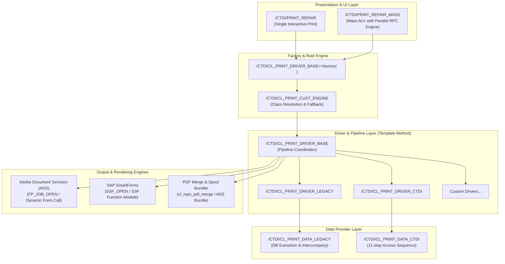
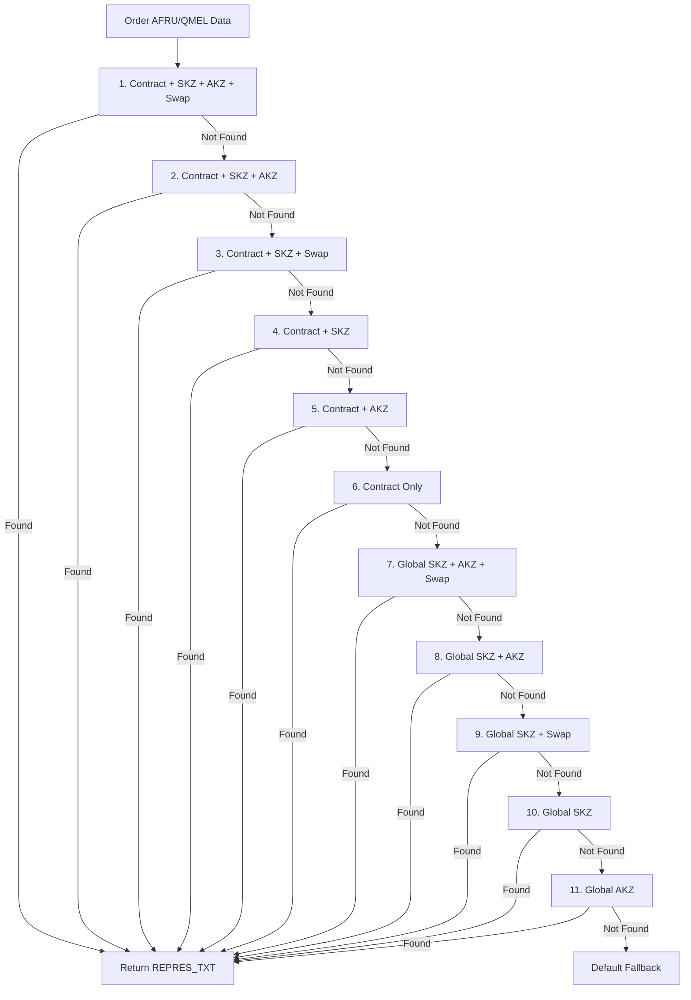

# Architecture Analysis: /CTDI/ Print Framework & Mass Processing System

---

## 1. Executive Summary & System Purpose

The **/CTDI/ Print Framework** is an enterprise-grade, object-oriented ABAP solution designed to modernize legacy repair order printing (`/CELLAG/ALCAREP02`) into a decoupled, extensible, and high-performance print pipeline.

It bridges legacy SAP ERP repair workflows (`AUFK`, `QMEL`, `AFRU`, `VBAK`, `VBAP`) with modern **Adobe Document Services (ADS / PDF)** while maintaining full backward compatibility with **SmartForms**, supporting both single interactive execution and high-throughput parallel mass printing.

---

## 2. Architectural Layers & Design Patterns

### Layer 1: Presentation & Orchestration Layer
- **`/CTDI/PRINT_REPAIR`**: Single-order print execution transaction with interactive preview, PDF download, and print dialogs.
- **`/CTDI/PRINT_REPAIR_MASS`**: High-performance mass processing report featuring:
  - Full-screen `CL_SALV_TABLE` with custom GUI status (`MASS_ALV`).
  - Automatic selection deduplication prioritizing active confirmation (`AFRU-BEMOT` / `SKZ`) and primary notification (`QMEL-QMART = 'Z2'`).
  - Asynchronous parallel execution via `CL_ABAP_PARALLEL` across application server work processes.
  - Multi-document spool bundling (`SSF_OPEN` / `FP_JOB_OPEN`) and client-side PDF merging (`CL_RSPO_PDF_MERGE`).

### Layer 2: Customizing Engine & Factory Pattern
- **Pattern:** *Factory Method* + *Strategy Pattern*.
- **Mechanism:** `/CTDI/CL_PRINT_DRIVER_BASE=>factory( iv_repair_id )` resolves order metadata, queries the configuration table `/CTDI/REP_FORMS` via the 8-step fallback sequence, and dynamically instantiates the appropriate driver class via `/CTDI/CL_PRINT_CUST_ENGINE`.

### Layer 3: Print Pipeline & Template Method Pattern
- **Pattern:** *Template Method Pattern*.
- **Mechanism:** `/CTDI/CL_PRINT_DRIVER_BASE->execute( )` defines the immutable print lifecycle:
  1. `read_data( )` &rarr; Hook to extract raw database records.
  2. `map_and_register_data( )` &rarr; Hook to bind typed structures to form parameters.
  3. `render_form( )` &rarr; Dynamic dispatch to Adobe Form or SmartForm runtime.
  4. `download_pdf( )` &rarr; Client download or PDF xstring buffering.

### Layer 4: Data Provider Layer
- **`/CTDI/CL_PRINT_DATA_LEGACY`**: Reusable data extraction engine that resolves complex SAP relationships:
  - Order &rarr; Notification &rarr; Equipment &rarr; Serial number &rarr; Characteristic classification (`CABN`/`AUSP`).
  - Intercompany order redirection (`QMART = 'ZX'`) tracing origin orders via `QMFE` and `EKKN`.
- **`/CTDI/CL_PRINT_DATA_CTDI`**: Domain extension that maps legacy structures to `/CTDI/REPAIR` DDIC types and evaluates an **11-step rule access sequence** against `/CTDI/REP_RESULT`.

### Layer 5: Cross-Cutting Infrastructure
- **Logging:** `/CTDI/CL_PRINT_DRIVER_LOG` provides an isolated wrapper around SAP Application Log (`SLG1`), supporting runtime log level thresholds (`I`, `W`, `E`).
- **Exceptions:** Unified hierarchy (`/CTDI/CX_PRINT_DRIVER_ERROR`, `/CTDI/CX_NO_CONFIG_FOUND`, `/CTDI/CX_CUST_ERROR`) with diagnostic message propagation.

---

## 3. Core Access & Fallback Hierarchies

### A. 8-Step Form Configuration Resolution (`/CTDI/REP_FORMS`)
When resolving which form (and driver class) to invoke for a given repair order:

| Step | Contract (`VBELN`) | Confirmation Reason (`SKZ`) | QM Code (`AKZ`) | Granularity |
|:---:|:---:|:---:|:---:|---|
| **1** | Contract | SKZ | AKZ | Specific Contract + Reason + Code |
| **2** | Contract | SKZ | *Blank* | Specific Contract + Reason |
| **3** | Contract | *Blank* | AKZ | Specific Contract + Code |
| **4** | Contract | *Blank* | *Blank* | Contract Default |
| **5** | *Blank* | SKZ | AKZ | Global + Reason + Code |
| **6** | *Blank* | SKZ | *Blank* | Global + Reason |
| **7** | *Blank* | *Blank* | AKZ | Global + Code |
| **8** | *Blank* | *Blank* | *Blank* | System Global Fallback |

---

### B. 11-Step Repair Result Access Sequence (`/CTDI/REP_RESULT`)
When resolving customer-facing repair result text in `/CTDI/CL_PRINT_DATA_CTDI`:

---

## 4. Key Architectural Strengths

| Dimension | Implementation | Benefit |
|---|---|---|
| **Extensibility (OCP)** | New customer forms are added by creating a data provider subclass and inserting rows into `/CTDI/REP_FORMS`. | **Zero modification** to existing reports or core driver classes. |
| **Dual Form Technology** | Seamless execution of both Adobe Forms and SmartForms under a single API. | Allows gradual migration of legacy SmartForms to modern Adobe Interactive Forms. |
| **High Performance** | Asynchronous task parallelization (`CL_ABAP_PARALLEL`) with batch spool bundling. | Mass print jobs scaling from 10 to 1,000+ orders without UI locking or gateway timeouts. |
| **Clean Separation of Concerns** | UI orchestration &rarr; Pipeline coordinator &rarr; Data extraction &rarr; Rendering runtime. | Independent unit testability, zero GUI dependencies in driver classes, and full background job safety. |

---

## 5. Architectural Risks & Future Recommendations

1. **Database Decoupling (CDS Views / AMDP):**
   - *Current:* Complex JOINs and `SELECT SINGLE` queries in `/CTDI/CL_PRINT_DATA_LEGACY` query transactional tables directly.
   - *Future:* Encapsulate data fetching into Core Data Services (CDS) views for SAP S/4HANA readiness and performance optimization.
2. **RFC Server Group Configuration:**
   - *Current:* Parallel processing uses standard server resources.
   - *Future:* Add an explicit RFC Server Group parameter to selection screens to prevent exhausting dialog processes during peak operating hours.
