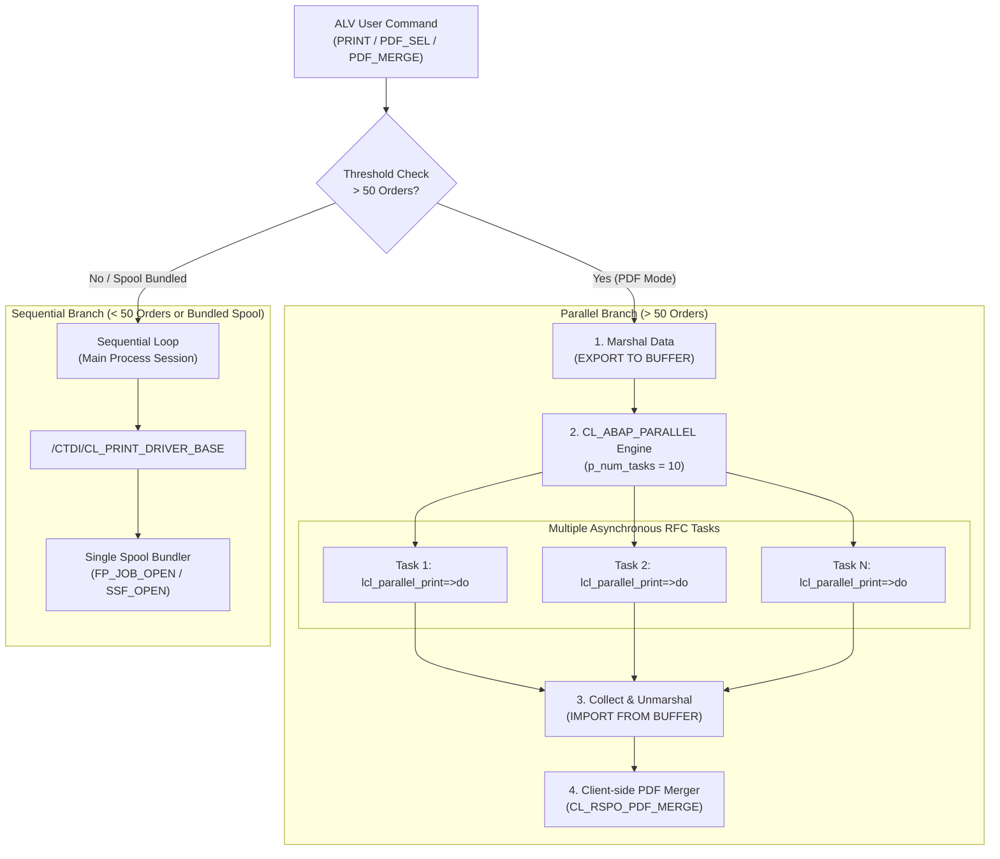
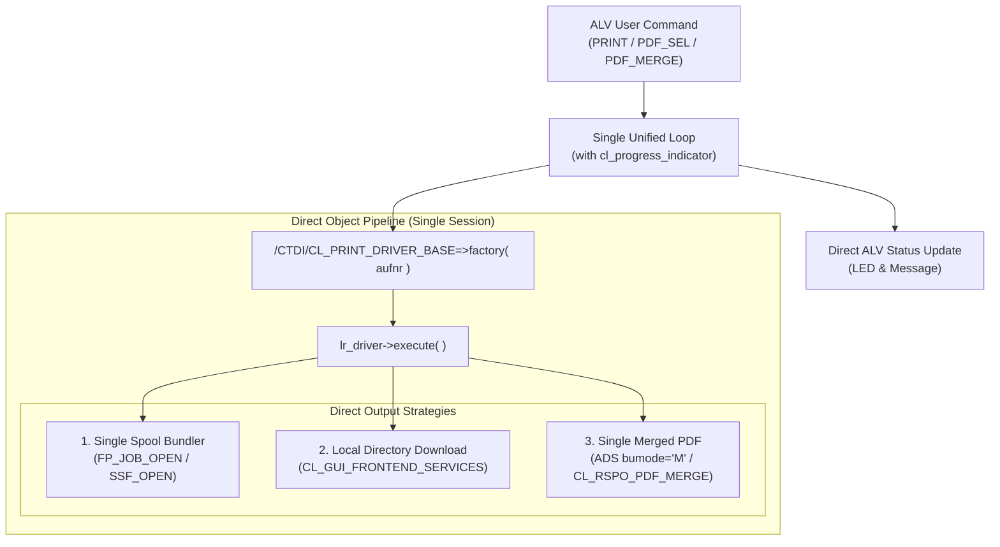

# Architecture Comparison: Parallel Processing vs. Simplified Sequential

---

## 1. Option A: Architecture WITH Parallel Processing (Current State)

### Key Characteristics:
- **Dual Pipeline:** Conditional bifurcation based on order count and execution mode.
- **Inter-Process Marshaling:** Uses `EXPORT ... TO DATA BUFFER` and `IMPORT ... FROM DATA BUFFER`.
- **Spool Limitation:** Parallel tasks **cannot share an open spool** (`FP_JOB_OPEN`/`SSF_OPEN`), requiring separate sequential fallback for bundled printing.

---

## 2. Option B: Architecture WITHOUT Parallel Processing (Simplified Sequential)

### Key Characteristics:
- **Single Linear Pipeline:** 100% deterministic and transparent.
- **Direct Memory Access:** Eliminates buffer serialization entirely.
- **Spool Native:** Native single-spool bundling for all orders.
- **Progress Tracking:** Real-time percentage update per order via `cl_progress_indicator`.

---

## 3. Side-by-Side Architectural Matrix

| Metric | With Parallel (`cl_abap_parallel`) | Without Parallel (Simplified) |
|---|:---:|:---:|
| **Code Size** | ~1,036 lines | **~860 lines** ($-170$ lines) |
| **Execution Paths** | Dual (Parallel + Sequential) | **Single unified engine** |
| **Data Flow** | Binary Buffer Serialization | **Direct in-memory objects** |
| **Debugging** | Complex (Requires RFC/SM50 debugging) | **Trivial (Standard breakpoints)** |
| **Spool Bundling** | Incompatible across parallel tasks | **100% Native single spool** |
| **Server Resource Safety** | Consumes up to 10 dialog work processes | **1 session process only** |
| **Batch Compatibility** | Complex background RFC handling | **Rock-solid in SM36 / SM37** |
| **Throughput (200 Orders)** | ~15–20 seconds | **~30–45 seconds** |

---

## 4. Architectural Verdict

> [!TIP]
> **Maintainability & Reliability Recommendation:**
> Unless you have strict SLA requirements demanding sub-20-second exports for $>500$ individual PDFs in interactive dialog mode, **Option B (Simplified Sequential)** is strongly recommended. It eliminates ~170 lines of boilerplate, eliminates RFC concurrency failures, and ensures single-session spool bundling works seamlessly.
