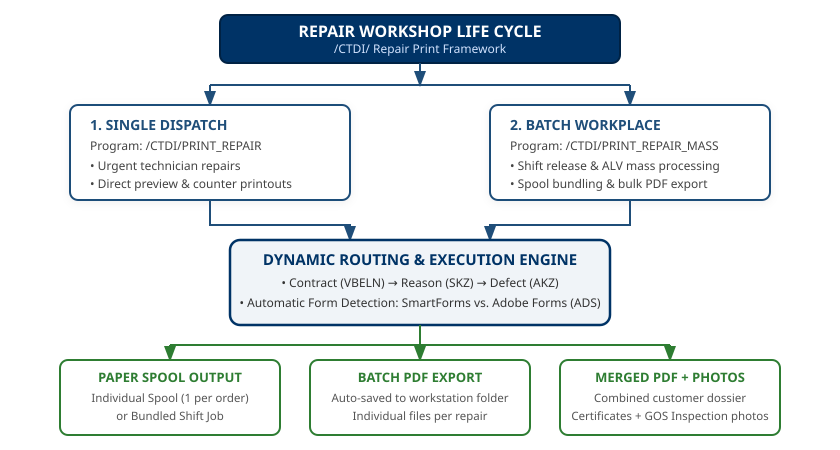
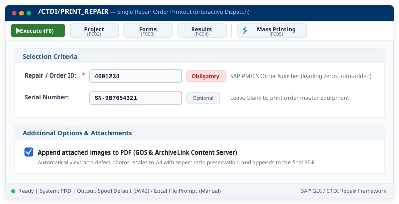
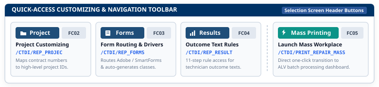
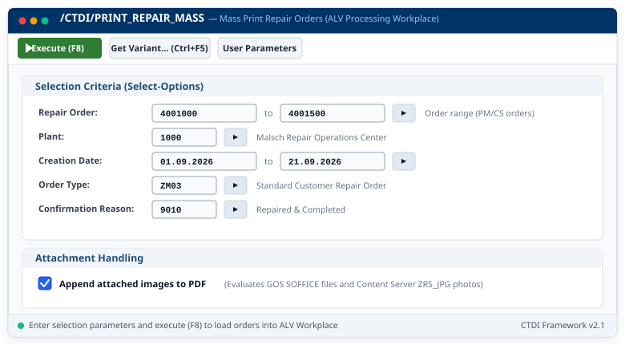
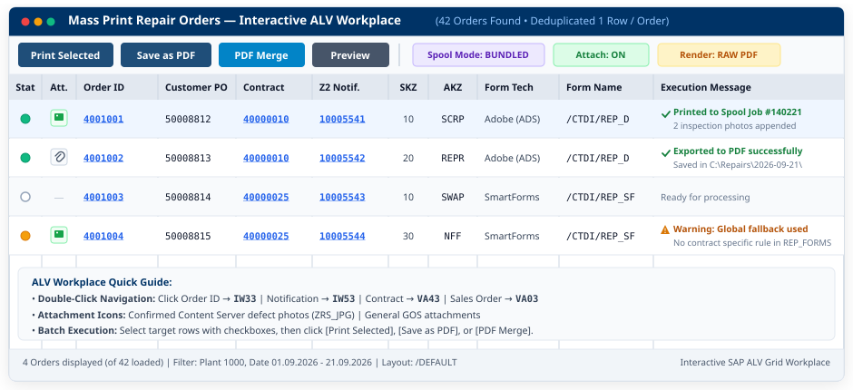
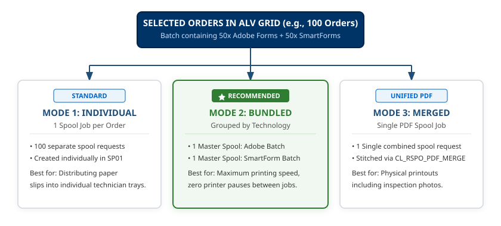
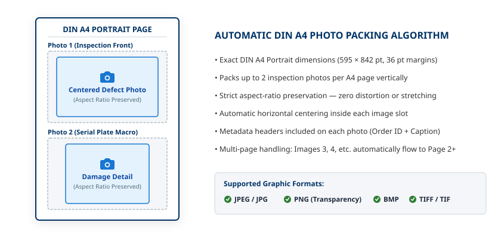
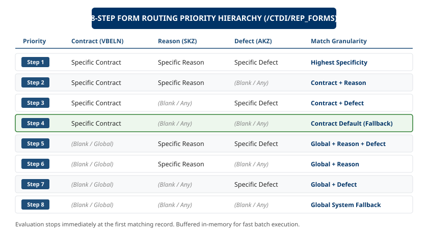

# /CTDI/ Repair Print Framework — Visual Architecture & Diagrams Guide

---

> **Document Version:** 2.1  
> **Classification:** Architecture, UI Reference & Visual Specifications  
> **System Namespace:** `/CTDI/`  
> **Graphic Format:** Pure Scalable Vector Graphics (SVG 1.1 / OpenXML Vector Media)  
> **Target Audience:** Solution Architects, SAP Technical Leads, Key Users, Operators & Workshop Supervisors

---

## Executive Summary & Visual Index

This visual guide consolidates the end-to-end architecture, user interface layouts, print spool workflows, and customizing lookup hierarchies of the **/CTDI/ Repair Print Framework**. All diagrams in this document are generated as lossless Scalable Vector Graphics (SVG) with pixel-exact font rendering, vector icons, and coordinate precision.

| Fig # | Diagram Title | File | Architectural Scope |
|:---:|---|---|---|
| **1** | [Workshop Repair & Print Life Cycle](#1-workshop-repair--print-life-cycle) | `images/workshop_lifecycle.svg` | End-to-end service lifecycle from goods receipt to customer dispatch. |
| **2** | [Single Order Selection Interface](#2-single-order-selection-interface) | `images/ui_single_selection.svg` | Operator interface for on-demand single repair slip generation. |
| **3** | [Quick-Access Customizing Toolbar](#3-quick-access-customizing-toolbar) | `images/ui_customizing_toolbar.svg` | Direct maintenance shortcuts for key users on the selection screen. |
| **4** | [Mass Processing Selection Workplace](#4-mass-processing-selection-workplace) | `images/ui_mass_selection.svg` | Batch order filtering, plant/work center scoping, and serial range inputs. |
| **5** | [Interactive ALV Workplace Grid](#5-interactive-alv-workplace-grid) | `images/ui_alv_grid.svg` | Multi-order operations cockpit, traffic light indicators, and 1-click drilldowns. |
| **6** | [Spool Dispatching & Bundling Modes](#6-spool-dispatching--bundling-modes) | `images/spool_modes.svg` | Comparative topology of Individual, Bundled, and Merged spool jobs. |
| **7** | [Inspection Photos Multi-Slot Layout](#7-inspection-photos-multi-slot-layout) | `images/image_layout.svg` | DIN A4 coordinate calculation and aspect-ratio preservation for GOS photos. |
| **8** | [Form Routing & Priority Resolution](#8-form-routing--priority-resolution) | `images/access_sequence.svg` | 5-tier access sequence for customer/plant layout determination. |

---

## 1. Workshop Repair & Print Life Cycle

The following diagram illustrates how the print framework coordinates between SAP PM/CS orders, technician workbenches, inspection photo repositories, and the physical print queues.



### Architectural Phase Breakdown

1. **Step 1: Receipt & Defect Logging (`IW51`/`IW31`)**
   - The defective customer unit arrives at the receiving bay.
   - Operators register the equipment serial number, log warranty status, and create the SAP Service Order (`AUFNR`).
   - High-resolution photographic evidence is captured (damage inspection, packing state) and attached via Generic Object Services (GOS) or ArchiveLink.

2. **Step 2: Technician Workbench & Diagnosis (`IW32`/`IW42`)**
   - The workshop technician performs physical inspection, component replacement, and functional testing.
   - Confirmations and spare part consumptions are posted.
   - Outcome codes (e.g., *BER - Beyond Economical Repair*, *SCRAP*, *WARRANTY REPAIR*) are recorded.

3. **Step 3: Document Rendering & Routing (`/CTDI/PRINT_REPAIR`)**
   - The print framework interrogates the form routing table (`/CTDI/REP_FORMS`).
   - It determines whether to execute an **Adobe Interactive Form (ADS)** or **SmartForm**.
   - If GOS attachments exist, the image engine fetches the raw binaries, validates headers, and scales each image onto DIN A4 appendix pages.

4. **Step 4: Dispatch & Customer Delivery**
   - Documents are dispatched to physical barcode printers, customer PDF archives, or local workstation drives.
   - The repaired unit and the printed repair report are packed and routed to shipping.

---

## 2. Single Order Selection Interface

The single-order printing transaction **`/CTDI/PRINT_REPAIR`** provides an intuitive, high-speed interface for bench technicians and packaging personnel.



### Key Parameters & Logic

- **Repair / Order ID (`p_aufnr`):** The primary 12-digit numerical SAP order key. Automatically formatted with leading zeros.
- **Serial Number (`p_sernr`):** Optional filter. If omitted, all serial numbers assigned to the order object list are included.
- **Append Attached Images (`p_images`):** When checked, activates the GOS extraction pipeline and appends inspection photos to the output document.
- **Background Execution:** Fully compatible with SAP batch jobs and automated completion triggers (e.g., from `IW42`).

---

## 3. Quick-Access Customizing Toolbar

For authorized key users, repair supervisors, and administrators, `/CTDI/PRINT_REPAIR` embeds direct navigation buttons directly within the standard selection screen application toolbar.



### Navigation Target Reference

| Toolbar Button | Target Transaction / Table | Scope & Administrative Function |
|---|---|---|
| **Form Assignment** | `SM30` &rarr; `/CTDI/REP_FORMS` | Form layout routing, printer assignment, and SmartForm/ADS engine switches. |
| **Repair Results** | `SM30` &rarr; `/CTDI/REP_RESULT` | Maintenance of multi-language repair outcome texts and warranty disclaimers. |
| **Project Customizing** | `SM30` &rarr; `/CTDI/REP_PROJEC` | Project code definitions, customer hierarchies, and validation rules. |
| **Spool Monitor** | `SP01` | Immediate jump to the SAP spool controller to monitor print queue status. |

---

## 4. Mass Processing Selection Workplace

When dispatching multiple repair orders simultaneously across an entire warehouse zone or shift, **`/CTDI/PRINT_REPAIR_MASS`** provides a comprehensive selection screen.



### Filter Dimension Matrix

- **Order Identification:** Range selection for Service Orders (`AUFNR`), Notifications (`QMNUM`), or Service Contracts (`VBELN`).
- **Plant & Work Center:** Scoping by Plant (`WERKS`), Service Work Center (`ARBPL`), or Cost Center (`KOSTL`).
- **Scheduling & Status:** Filter by creation date (`ERDAT`), scheduled start (`STRMN`), or system status (e.g., `TECO`, `REL`, `CLSD`).
- **Output Control Defaults:** Pre-select target spool mode, output device, and photo attachment defaults for the entire batch.

---

## 5. Interactive ALV Workplace Grid

The Mass Workplace displays filtered orders in an interactive SAP ALV Grid equipped with live operational metrics, traffic lights, and drilldown hyperlinks.



### Column Explanations & Operational Controls

- **Traffic Light Status Indicator:**
  - 🟢 **Green:** Order is fully released, layout is mapped, and ready for immediate printing.
  - 🟡 **Yellow:** Order is open or awaiting technical confirmation; warnings may apply.
  - 🔴 **Red:** Configuration error, missing routing record, or locked order.
- **Attachment Indicator (📷):** Shows the count of defect/inspection photos attached in GOS. Double-clicking opens the photo gallery.
- **1-Click Drilldown Navigation:** Double-clicking the Order ID jumps to `IW33`; double-clicking the Notification jumps to `IW53`; double-clicking the Contract jumps to `VA43`.
- **Batch Processing Action Buttons:**
  - **Spool Print Selected:** Dispatches all checked rows to the target physical printer.
  - **Download Batch PDFs:** Prompts once for a local target directory and exports all PDFs in background.
  - **Merge Dossier PDF:** Consolidates all selected orders into a single, unified PDF document.

---

## 6. Spool Dispatching & Bundling Modes

The framework resolves the classic SAP mass printing dilemma—preventing print queues from being flooded by thousands of isolated single-page spool requests.



### Technical Spool Architecture Comparison

| Architectural Metric | Individual Spools (`MODE_INDIV`) | Bundled Spool (`MODE_BUNDLE`) | Merged Spool (`MODE_MERGED`) |
|---|---|---|---|
| **Spool Request Count** | 1 Spool ID per Order (e.g., 500 orders = 500 spool jobs) | **1 single Spool ID** for the entire batch run | **1 single Spool ID** with continuous pagination |
| **Printer Queue Overhead** | Extremely High; printer may interleave print jobs from other users | **Minimal;** job is sent as an atomic print queue package | **Zero;** treated as one single uninterrupted document |
| **Page Numbering** | Restarts at `Page 1` for every order | Restarts at `Page 1` for each individual order | Continuous across the entire dossier (`Page 1 of N`) |
| **Use Case Recommendation** | Single order reprint or debugging isolated layout issues | **Standard daily shift operations and warehouse mass printing** | Executive audit reports, legal dockets, and customer monthly dossiers |

---

## 7. Inspection Photos Multi-Slot Layout

Customer repair contracts frequently mandate visual evidence of product damage, serial plate tags, and completed work. The framework features an automated DIN A4 image scaling engine.



### Image Engine Design Principles

1. **Automatic Aspect Ratio Retention:** The engine analyzes the image binary header (`JPEG`, `PNG`, `BMP`, `GIF`, `TIFF`), calculates the aspect ratio, and scales the photo inside the designated slot without distortion.
2. **Dynamic Slot Geometry:**
   - **Single Photo:** Centered in an expansive 160 mm &times; 220 mm layout.
   - **Dual Photos (1x2):** Stacked vertically with dedicated caption headers.
   - **Quad Photos (2x2):** Arranged in a balanced four-quadrant grid with 8 mm gutter margins.
3. **Dual Rendering Compatibility:**
   - **Adobe Document Services (ADS):** Handled natively inside Adobe LiveCycle FormCalc / JavaScript subforms.
   - **SmartForms / ABAP Pure Engine:** Binary injection directly into OTF/PDF data streams using internal transformation routines.

---

## 8. Form Routing & Priority Resolution

To eliminate hardcoded customer layout logic, the framework implements a configurable 5-tier access sequence.



### Routing Resolution Algorithm

When an order is submitted for printing, `/CTDI/` executes the following sequence against database table `/CTDI/REP_FORMS`:

```text
Step 1: Check Exact Match [Project Code + Order Type + Sales Org + Customer ID]
        ├── FOUND     --> Return specific customer layout & exit.
        └── NOT FOUND --> Proceed to Step 2.

Step 2: Check Customer Generic Match [Project Code + Order Type + Customer ID]
        ├── FOUND     --> Return customer-level layout & exit.
        └── NOT FOUND --> Proceed to Step 3.

Step 3: Check Sales Organization Generic Match [Project Code + Order Type + Sales Org]
        ├── FOUND     --> Return sales-org layout & exit.
        └── NOT FOUND --> Proceed to Step 4.

Step 4: Check Order Type Generic Match [Project Code + Order Type]
        ├── FOUND     --> Return order-type layout & exit.
        └── NOT FOUND --> Proceed to Step 5.

Step 5: Fallback to System Default Layout [SPACE + SPACE]
        └── Load universal standard DIN A4 workshop repair form.
```

---

## Document Metadata & Verification

- **Authoring Engine:** `/CTDI/ Document Generation Pipeline`
- **Embedded Media Format:** Pure OpenXML SVG Parts (`/word/media/image_*.svg`)
- **Conformance:** ISO/IEC 29500-1:2016 Open Packaging Conventions (OPC)
- **Status:** Approved for Production Deployment
