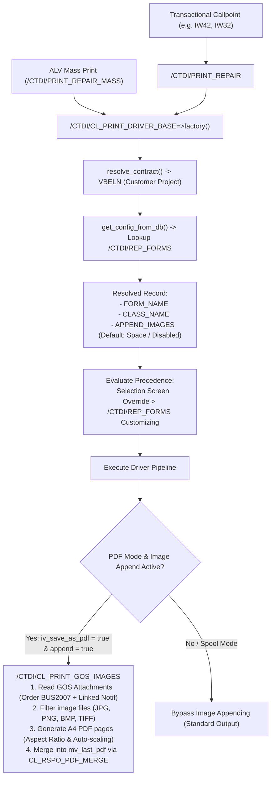

# GOS Image Appending Feature Documentation

## 1. Overview & Purpose

The **GOS Image Appending** feature extends the CTDI DynAbap repair order print pipeline to automatically retrieve Generic Object Services (GOS) image attachments linked to a **Repair Order (AUFNR)** and its **Linked Service Notification (QMNUM)**, convert them into standardized DIN A4 PDF pages with strict aspect-ratio preservation and auto-scaling, and merge them into the final **PDF output** (file download, mass PDF merge, and PDF archiving).

---

## 2. Core Architecture & Operating Principles

### 2.1 PDF-Only Execution (Spool Isolation)
- **PDF Generation (`iv_save_as_pdf = abap_true`)**: Image appending is active during PDF generation and download workflows.
- **Spool / Physical Paper Printing (`iv_save_as_pdf = abap_false`)**: GOS images are **not** appended to physical paper spool outputs at this time. Standard form printing to spool remains completely untouched and isolated.

### 2.2 Two-Tier Precedence Model



#### Precedence Matrix

| Trigger / Context | Selection Screen Setting | `/CTDI/REP_FORMS` Customizing | Effective Result (PDF Mode) |
|---|---|---|---|
| **Standard Callpoint (`IW42`, `IW32`)** | *Not Passed / Default* | **`X` (Enabled)** | **Appends Images** |
| **Standard Callpoint (`IW42`, `IW32`)** | *Not Passed / Default* | **` ` (Disabled)** | **No Images** |
| **Manual Execution (Single / Mass Print)** | **`Default (Customizing)`** | Follows `/CTDI/REP_FORMS` | Follows Customizing |
| **Manual Execution (Single / Mass Print)** | **`Force Append Images` ('X')** | Any (`X` or ` `) | **Appends Images** |
| **Manual Execution (Single / Mass Print)** | **`Force Suppress Images` ('N')** | Any (`X` or ` `) | **No Images** |

---

## 3. Data Dictionary & Customizing Configuration

### 3.1 Table `/CTDI/REP_FORMS`

The transparent table `/CTDI/REP_FORMS` controls form layout, driver class, and image appending behavior per **Contract (`VBELN` = Customer Project)**, Confirmation Reason (`SKZ`), and Reason Code (`AKZ`).

| Field Name | Key | Data Element | Type (Length) | Description |
|---|---|---|---|---|
| `MANDT` | **X** | `MANDT` | `CLNT (3)` | Client |
| `VBELN` | **X** | `VBELN` | `CHAR (10)` | Contract / Customer Project |
| `SKZ` | **X** | `BEMOT` | `CHAR (2)` | Confirmation Reason |
| `AKZ` | **X** | `/CELLAG/CS_AKZ` | `CHAR (4)` | Reason / Damage Code |
| `FORM_NAME` | | `FPNAME` | `CHAR (30)` | Form Name (SmartForm or Adobe Form) |
| `CLASS_NAME` | | `SEOCLSNAME` | `CHAR (30)` | Driver Subclass Name |
| **`APPEND_IMAGES`** | | **`SAP_BOOL`** | **`CHAR (1)`** | **Append GOS Images (`X` = Yes, ` ` = No)** |

* **Default Value**: Initial / `space` (Disabled).
* **Maintenance**: Maintained via transaction `SM30` / table maintenance dialog `/CTDI/WORKSHOP_M`.

---

## 4. Selection Screen Options & Reports

All print reports provide a dedicated selection screen block for runtime overrides:

```abap
SELECTION-SCREEN BEGIN OF BLOCK b_img WITH FRAME TITLE TEXT-020.
PARAMETERS: p_imgdef RADIOBUTTON GROUP r_img DEFAULT 'X', " Default (Project Customizing)
            p_imgyes RADIOBUTTON GROUP r_img,              " Force Append Images
            p_imgno  RADIOBUTTON GROUP r_img.              " Force Suppress Images
SELECTION-SCREEN END OF BLOCK b_img.
```

### Supported Reports
1. **`/CTDI/PRINT_REPAIR`**: Single repair order print orchestrator.
2. **`/CTDI/PRINT_REPAIR_MASS`**: ALV mass printing report with individual, bundled, and merged spool/PDF execution.
3. **`/CTDI/PRINT_REPAIR_MASS_PRLL`**: Parallel RFC mass printing report.

---

## 5. Technical Implementation Details

### 5.1 Helper Class: `/CTDI/CL_PRINT_GOS_IMAGES`

The helper class encapsulates all attachment querying, dimension extraction, PDF page rendering, and PDF stitching.

#### Key Methods

| Method | Visibility | Description |
|---|---|---|
| `append_images( iv_repair_order, iv_pdf )` | `PUBLIC` | High-level orchestrator: queries attachments, renders A4 PDF pages, and merges with `iv_pdf`. |
| `get_attachments( iv_repair_order )` | `PUBLIC` | Retrieves attachments for Order (`BUS2007`) and linked Notification (`BUS2078`/`QMEL`). |
| `resolve_notification( iv_aufnr )` | `PUBLIC` | Resolves linked `QMNUM` from `AUFK-QMNUM` / `QMEL-QMNUM`. |
| `filter_image_attachments( it_raw )` | `PUBLIC STATIC` | Filters for supported extensions (`JPG`, `JPEG`, `PNG`, `BMP`, `TIF`, `TIFF`). |
| `extract_image_dimensions( iv_content, iv_ext )` | `PUBLIC STATIC` | Parses raw JPEG markers (`SOF0`/`SOF2`) and PNG `IHDR` chunks to determine original image width and height. |
| `convert_images_to_pdf( it_attachments )` | `PUBLIC` | Generates a standard DIN A4 PDF stream embedding images. |
| `merge_pdfs( iv_base_pdf, iv_images_pdf )` | `PUBLIC` | Merges two PDF byte streams via `CL_RSPO_PDF_MERGE`. |

#### Multi-Image A4 Layout & Sizing Algorithm
- **Target Dimensions**: DIN A4 Portrait ($595.28 \times 841.89$ PostScript points, $36\text{ pt}$ margins).
- **Usable Printable Area**: $523.28\text{ pt}$ width $\times 769.89\text{ pt}$ height.
- **Page Packing**: Up to **2 images per A4 page** vertically stacked.
  - **Slot 1 (Top)**: $Y_{\text{top}} \approx 805\text{ pt}$, Max slot height $\approx 360\text{ pt}$.
  - **Slot 2 (Bottom)**: $Y_{\text{top}} \approx 425\text{ pt}$, Max slot height $\approx 360\text{ pt}$.
  - Additional images (3rd, 4th, etc.) automatically start new A4 pages.
- **Scaling & Aspect Ratio**:
  $$\text{Scale Factor } s = \min\left( \frac{\text{Available Width}}{\text{Raw Width}}, \frac{\text{Available Height}}{\text{Raw Height}}, 1.0 \right)$$
  $$\text{Scaled Width } w' = \text{Raw Width} \times s, \quad \text{Scaled Height } h' = \text{Raw Height} \times s$$
  - Image aspect ratio is strictly preserved (no stretching or distortion).
  - Images are horizontally centered in each slot.
  - Each slot includes a metadata caption header (e.g. `[Repair Order] defect_photo.jpg`).

---

### 5.2 Print Driver Framework: `/CTDI/CL_PRINT_DRIVER_BASE`

#### Constants
```abap
CONSTANTS gc_img_override_default TYPE char1 VALUE space. " Follow /CTDI/REP_FORMS customizing
CONSTANTS gc_img_override_yes     TYPE char1 VALUE 'X'.   " Force append images
CONSTANTS gc_img_override_no      TYPE char1 VALUE 'N'.   " Force suppress images
```

#### Factory Method
```abap
CLASS-METHODS factory
  IMPORTING iv_repair_id     TYPE aufnr
            iv_sernr         TYPE equi-sernr OPTIONAL
            iv_append_images TYPE char1      DEFAULT gc_img_override_default
  RETURNING VALUE(ro_driver) TYPE REF TO /ctdi/cl_print_driver_base
  RAISING   /ctdi/cx_print_driver_error
            /ctdi/cx_no_config_found.
```

#### Execution Hook Integration
In `download_pdf()`:
```abap
" Always store last generated PDF for potential merge scenarios
mv_last_pdf = iv_pdf_data.

" Process GOS image appending if enabled (PDF mode only)
IF mv_append_images = abap_true.
  process_image_attachments( ).
ENDIF.
```

---

## 6. Error Handling & Graceful Degradation

- **No Images Found**: Returns the original `mv_last_pdf` unaltered without error.
- **GOS Read Failure / Corrupt Files**: Logs warning via `/CTDI/CL_PRINT_DRIVER_LOG` and returns the base PDF safely.
- **PDF Merge Failure**: Falls back to the unmerged base PDF so workshop users always receive their form printout.

---

## 7. Testing & Verification

### 7.1 Automated ABAP Unit Tests
- **`/CTDI/CL_PRINT_GOS_IMAGES` Test Suite** (`#ctdi#cl_print_gos_images.clas.testclasses.abap`):
  - Attachment filtering (JPG/PNG vs PDF/TXT/DOCX).
  - JPEG & PNG dimension parser verification.
  - Single-image and multi-image (page overflow) PDF construction.
  - Merge handling with empty inputs.
  - Special character caption escaping.
- **`/CTDI/CL_PRINT_DRIVER_BASE` Test Suite** (`#ctdi#cl_print_driver_base.clas.testclasses.abap`):
  - Getter/setter validation.
  - Override precedence logic.
  - Image hook bypass verification when flag is disabled.

### 7.2 Linter Compliance
- Validated with `@abaplint/cli 2.120.35`: **0 issues / 0 errors across 88 repository files**.
