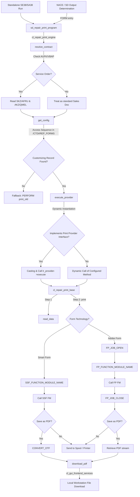

# DynAbap — Dynamic Printing Flow Documentation

This document describes the design, architecture, and runtime execution pipeline of the dynamic printing engine in **DynAbap**.

---

## 1. Triggering Entry Points

The print process is initiated via the standard output wrapper program: **`/ctdi/sd_repair_print_program`**. This program supports two execution paths:

* **Standalone / Manual Mode (SE38 / SA38 / Standalone Execution)**:
  * Triggered when run directly via the selection screen.
  * Prompts the user for a **Service Order / Repair ID (`p_aufnr`)**, Serial Number, and a `p_pdf` checkbox (to direct spool output to a local PDF download).
* **Output Determination Mode (NACE / Message Control)**:
  * Triggered automatically by standard SAP message control (e.g., SD/CS billing or service order save events).
  * The SAP framework calls the subroutine **`FORM entry`** inside `/ctdi/sd_repair_print_program` with global tables `nast` and `tnapr` initialized.
  * The Sales Document / Repair ID is fetched dynamically from `nast-objky`.

---

## 2. Dynamic Engine Resolution (`/CTDI/CL_REPAIR_PRINT_ENGINE`)

Once the print program is invoked, it instantiates the central orchestrator class `/CTDI/CL_REPAIR_PRINT_ENGINE` and calls `execute()`, triggering the following stages:

### Step A: Contract & Order Resolution (`resolve_contract`)
* Checks if the provided `iv_repair_id` corresponds to a PM/CS Service Order by querying standard table `AUFK`.
* It performs an outer join with `VBAP` to find the corresponding **Sales/Repair Contract ID (`ev_contract_id`)**.
* If it is a Service Order, it dynamically queries:
  * The **SKZ Selector (Service Category)**: Fetched from confirmations table `AFRU` (specifically for operation `'9010'`).
  * The **AKZ Selector (Notification Code)**: Fetched from notifications table `QMEL` (specifically for type `'Z2'`).
* If no Service Order VBAP link is found, it treats the document as a standard Sales Document.

### Step B: Access Sequence Customizing Lookup (`get_config`)
* Queries customizing table **`/CTDI/REP_FORMS`** to match the resolved Contract, SKZ, and AKZ.
* Performs up to **7 Access Sequence steps** in a priority hierarchy:
  1. Specific Contract + Specific SKZ + Specific AKZ
  2. Specific Contract + Specific SKZ + Generic AKZ
  3. Specific Contract + Generic SKZ + Specific AKZ
  4. Specific Contract + Generic SKZ + Generic AKZ
  5. Generic Contract + Specific SKZ + Specific AKZ
  6. Generic Contract + Specific SKZ + Generic AKZ
  7. Generic Contract + Generic SKZ + Specific AKZ
* Results are buffered inside class attribute `mt_config_buffer` for rapid sequential printing.
* **Fallback Routing**: If no configuration is active or defined in `/CTDI/REP_FORMS`, it raises `/ctdi/cx_no_config_found`. The wrapper program catches this and routes execution to standard legacy routines (`PERFORM print_old`).

---

## 3. Dynamic Printing Class Execution (`execute_provider`)

If a customizing record exists, the engine resolves which ABAP print class to run:

1. **Instantiation**:
   * If the customizing class name is empty, it falls back to the standard base class: `/CTDI/CL_REPAIR_PRINT_BASE`.
   * Otherwise, it dynamically instantiates the custom SE24 printer class configured for that contract (e.g. `/CTDI/CL_REPAIR_PRINT_1234567890`) which implements `/CTDI/IF_REPAIR_PRINT_PROVIDER`.
2. **Method Invocation**:
   * If the class implements the interface, it casts the instance and calls `lr_provider->execute()`.
   * If the class is a legacy class that does not implement the interface, it performs a dynamic method call (`CALL METHOD lr_instance->(lv_method_name)`) to execute the specific configured method.

---

## 4. Reading Data & Formatting Layout (`/CTDI/CL_REPAIR_PRINT_BASE`)

The print class (whether the base class or a custom subclass) runs a two-step printing pipeline:

1. **`read_data`**: Fetches order items, serial numbers, customer details, and repair errors to populate the `cs_repair` data structure.
2. **`print` (Form Technology Auto-Detection)**:
   * The class queries standard table `STXFADM` to check if the configured `iv_form_name` exists as a **Smart Form**.
   * If a record is found, it executes the **Smart Form** pipeline.
   * If not, it defaults to executing the **Adobe PDF-based Form** pipeline.

---

## 5. Form Output Engine Execution

```
                       ┌────────────────────────────────┐
                       │       Form Technology?         │
                       └───────────────┬────────────────┘
                                       │
                ┌──────────────────────┴──────────────────────┐
                │                                             │
      ┌─────────▼─────────┐                         ┌─────────▼─────────┐
      │   Smart Form      │                         │   Adobe Form      │
      └─────────┬─────────┘                         └─────────┬─────────┘
                │                                             │
 1. SSF_FUNCTION_MODULE_NAME                   1. FP_JOB_OPEN
 2. Apply USR01 Defaults                       2. FP_FUNCTION_MODULE_NAME
 3. Call Generated FM                          3. Call Generated FM
                │                              4. FP_JOB_CLOSE
                │                                             │
        ┌───────┴───────┐                             ┌───────┴───────┐
        │               │                             │               │
  ┌─────▼─────┐   ┌─────▼─────┐                 ┌─────▼─────┐   ┌─────▼─────┐
  │  To Spool │   │ Save PDF  │                 │  To Spool │   │ Save PDF  │
  └───────────┘   └─────┬─────┘                 └───────────┘   └─────┬─────┘
                        │                                             │
                  CONVERT_OTF                                   Get ADS Stream
                        │                                             │
                        └──────────────┬──────────────────────────────┘
                                       │
                             ┌─────────▼─────────┐
                             │ download_pdf      │
                             └─────────┬─────────┘
                                       │
                             File Save Dialog
                             gui_download
```

### Smart Forms Pipeline (Type `S`)
1. Resolves the dynamically generated function module name using standard API `SSF_FUNCTION_MODULE_NAME`.
2. Resolves and applies user print defaults (printer destination) from table `USR01`.
3. Executes the Smart Form function module.
4. **PDF Conversion**: If `iv_save_as_pdf` is requested, it intercepts the raw OTF spool data and converts it to a PDF byte stream (`xstring`) using `CONVERT_OTF`.

### Adobe Forms Pipeline (Type `A`)
1. Opens an Adobe Document Services (ADS) printing job using standard API `FP_JOB_OPEN`.
2. Resolves the generated function module using standard API `FP_FUNCTION_MODULE_NAME`.
3. Executes the Adobe Form function module, passing the repair data.
4. Closes the print job via standard API `FP_JOB_CLOSE`.
5. **PDF Retrieval**: If `iv_save_as_pdf` is requested, it retrieves the resolved PDF byte stream directly from the job output structure `ls_formoutput-pdf`.

---

## 6. Local PDF Output Download (`download_pdf`)

If a local PDF was requested:
1. The byte stream (`xstring`) is converted to a binary table via `SCMS_XSTRING_TO_BINARY`.
2. Standard GUI Save Dialog is invoked: `cl_gui_frontend_services=>file_save_dialog`.
3. The binary table is downloaded to the user's local PC via `cl_gui_frontend_services=>gui_download`.

---

## 7. Print Flow Architecture Diagram


