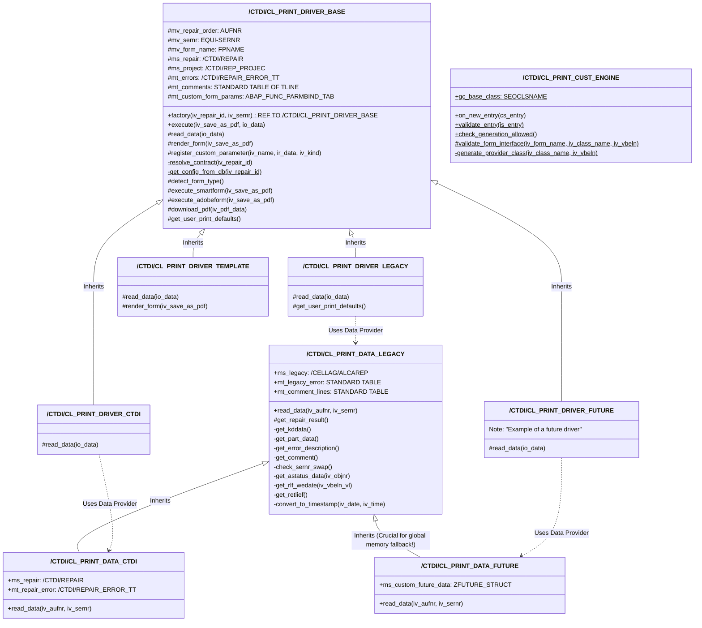
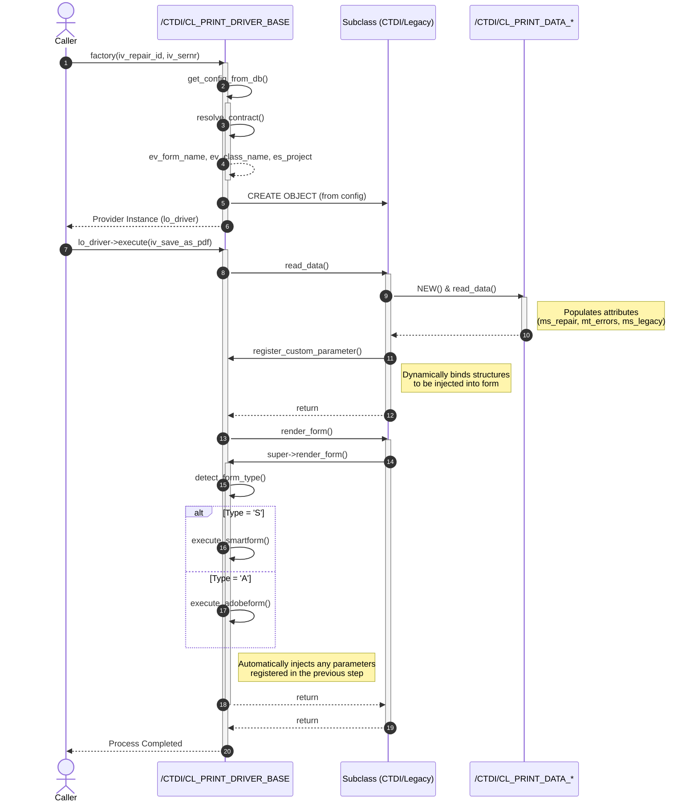

# Print Driver Architecture - NEW (Simplified)

## Class Diagram

> [!NOTE]
> **UML Visibility Notation Guide (ABAP Equivalents)**
> - `+` **Public** (`PUBLIC SECTION`): Accessible from anywhere.
> - `#` **Protected** (`PROTECTED SECTION`): Accessible within the class and its subclasses.
> - `-` **Private** (`PRIVATE SECTION`): Accessible only within the class itself.
> - `$` **Static** (`CLASS-METHODS` / `CLASS-DATA`): Indicated at the end of the method/attribute.

## Sequence Diagram (Execution Flow)

