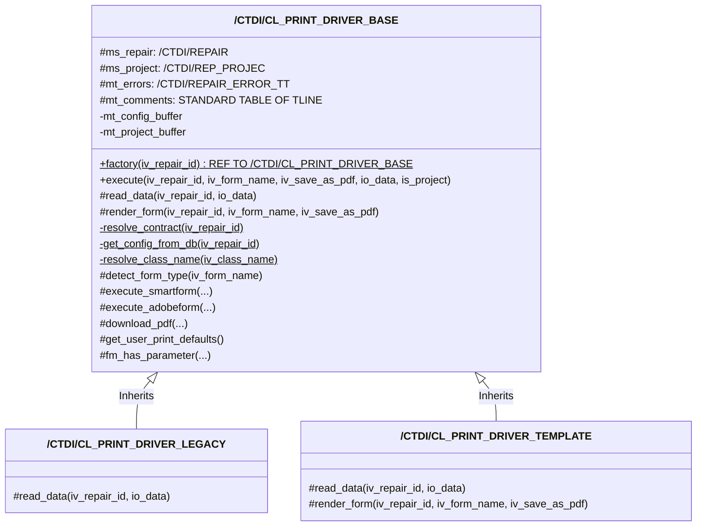
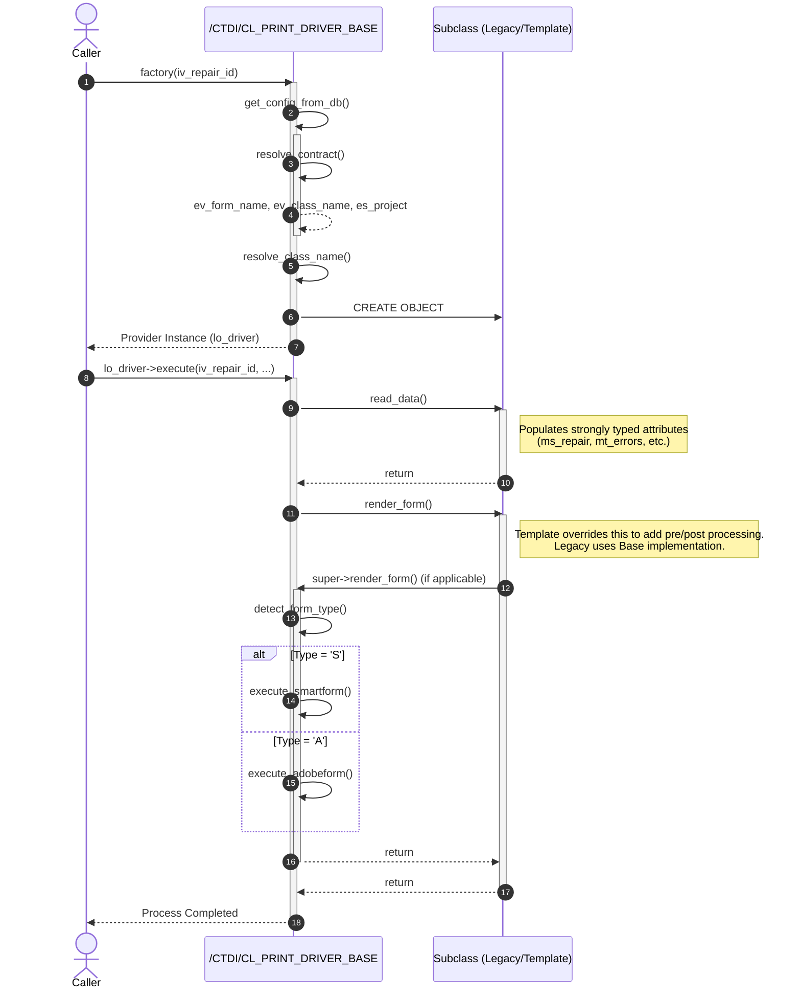

# Print Driver Architecture - NEW (Simplified)

## Class Diagram

```mermaid
classDiagram
    class `/CTDI/CL_PRINT_DRIVER_BASE` {
        #ms_repair: /CTDI/REPAIR
        #ms_project: /CTDI/REP_PROJEC
        #mt_errors: /CTDI/REPAIR_ERROR_TT
        #mt_comments: STANDARD TABLE OF TLINE
        -mt_config_buffer
        -mt_project_buffer
        +factory(iv_repair_id)$ REF TO /CTDI/CL_PRINT_DRIVER_BASE
        +execute(iv_repair_id, iv_form_name, iv_save_as_pdf, io_data, is_project)
        #read_data(iv_repair_id, io_data)
        #render_form(iv_repair_id, iv_form_name, iv_save_as_pdf)
        -resolve_contract(iv_repair_id)$
        -get_config_from_db(iv_repair_id)$
        -resolve_class_name(iv_class_name)$
        #detect_form_type(iv_form_name)
        #execute_smartform(...)
        #execute_adobeform(...)
        #download_pdf(...)
        #get_user_print_defaults()
        #fm_has_parameter(...)
    }

    class `/CTDI/CL_PRINT_DRIVER_LEGACY` {
        #read_data(iv_repair_id, io_data)
    }

    class `/CTDI/CL_PRINT_DRIVER_TEMPLATE` {
        #read_data(iv_repair_id, io_data)
        #render_form(iv_repair_id, iv_form_name, iv_save_as_pdf)
    }

    `/CTDI/CL_PRINT_DRIVER_BASE` <|-- `/CTDI/CL_PRINT_DRIVER_LEGACY` : Inherits
    `/CTDI/CL_PRINT_DRIVER_BASE` <|-- `/CTDI/CL_PRINT_DRIVER_TEMPLATE` : Inherits
```

## Sequence Diagram (Execution Flow)

```mermaid
sequenceDiagram
    autonumber
    actor Caller
    participant Base as /CTDI/CL_PRINT_DRIVER_BASE
    participant Subclass as Subclass (Legacy/Template)

    Caller->>Base: factory(iv_repair_id)
    activate Base

    Base->>Base: get_config_from_db()
    activate Base
    Base->>Base: resolve_contract()
    Base-->>Base: ev_form_name, ev_class_name, es_project
    deactivate Base

    Base->>Base: resolve_class_name()
    Base->>Subclass: CREATE OBJECT
    Base-->>Caller: Provider Instance (lo_driver)
    deactivate Base

    Caller->>Base: lo_driver->execute(iv_repair_id, ...)
    activate Base

    Base->>Subclass: read_data()
    activate Subclass
    Note right of Subclass: Populates strongly typed attributes<br/>(ms_repair, mt_errors, etc.)
    Subclass-->>Base: return
    deactivate Subclass

    Base->>Subclass: render_form()
    activate Subclass
    Note right of Subclass: Template overrides this to add pre/post processing.<br/>Legacy uses Base implementation.
    Subclass->>Base: super->render_form() (if applicable)
    activate Base
    
    Base->>Base: detect_form_type()
    alt Type = 'S'
        Base->>Base: execute_smartform()
    else Type = 'A'
        Base->>Base: execute_adobeform()
    end

    Base-->>Subclass: return
    deactivate Base
    Subclass-->>Base: return
    deactivate Subclass

    Base-->>Caller: Process Completed
    deactivate Base
```
