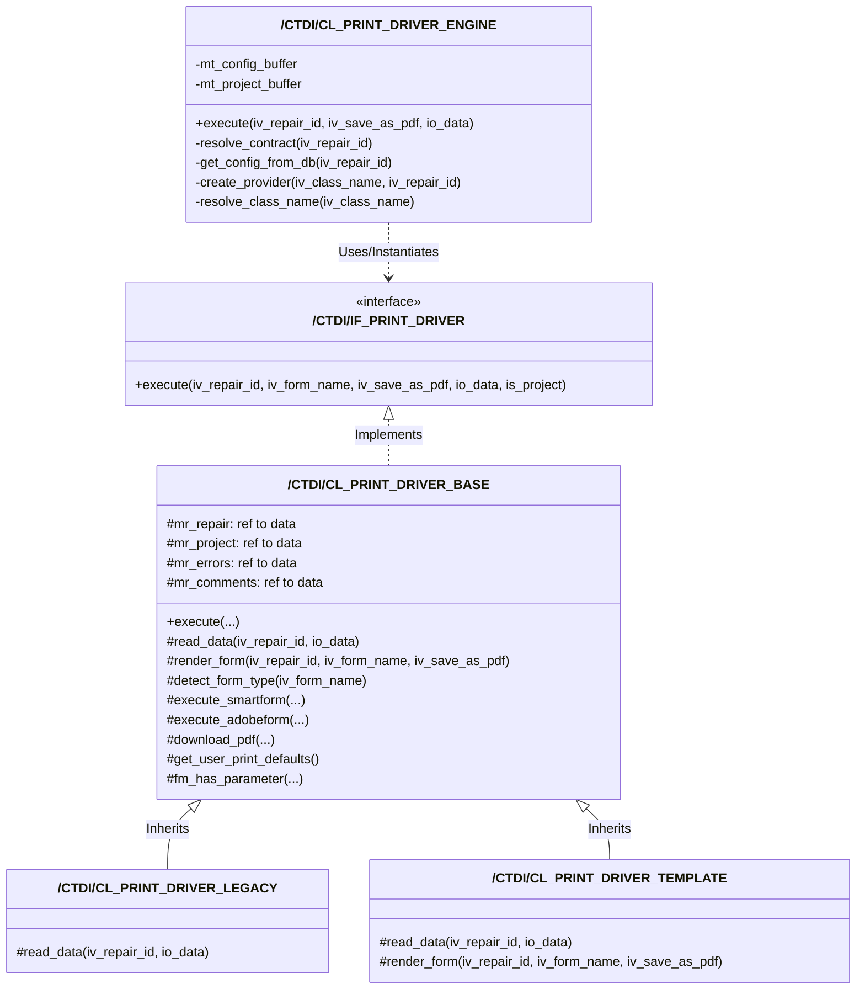
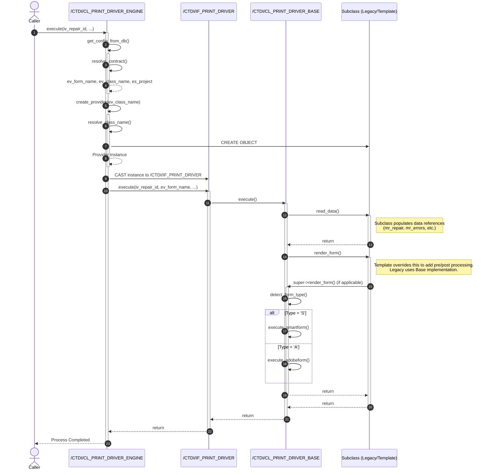

# Print Driver Architecture - OLD

## Class Diagram

```mermaid
classDiagram
    class `/CTDI/IF_PRINT_DRIVER` {
        <<interface>>
        +execute(iv_repair_id, iv_form_name, iv_save_as_pdf, io_data, is_project)
    }

    class `/CTDI/CL_PRINT_DRIVER_BASE` {
        #mr_repair: ref to data
        #mr_project: ref to data
        #mr_errors: ref to data
        #mr_comments: ref to data
        +execute(...)
        #read_data(iv_repair_id, io_data)
        #render_form(iv_repair_id, iv_form_name, iv_save_as_pdf)
        #detect_form_type(iv_form_name)
        #execute_smartform(...)
        #execute_adobeform(...)
        #download_pdf(...)
        #get_user_print_defaults()
        #fm_has_parameter(...)
    }

    class `/CTDI/CL_PRINT_DRIVER_LEGACY` {
        #read_data(iv_repair_id, io_data)
    }

    class `/CTDI/CL_PRINT_DRIVER_TEMPLATE` {
        #read_data(iv_repair_id, io_data)
        #render_form(iv_repair_id, iv_form_name, iv_save_as_pdf)
    }

    class `/CTDI/CL_PRINT_DRIVER_ENGINE` {
        -mt_config_buffer
        -mt_project_buffer
        +execute(iv_repair_id, iv_save_as_pdf, io_data)
        -resolve_contract(iv_repair_id)
        -get_config_from_db(iv_repair_id)
        -create_provider(iv_class_name, iv_repair_id)
        -resolve_class_name(iv_class_name)
    }

    `/CTDI/IF_PRINT_DRIVER` <|.. `/CTDI/CL_PRINT_DRIVER_BASE` : Implements
    `/CTDI/CL_PRINT_DRIVER_BASE` <|-- `/CTDI/CL_PRINT_DRIVER_LEGACY` : Inherits
    `/CTDI/CL_PRINT_DRIVER_BASE` <|-- `/CTDI/CL_PRINT_DRIVER_TEMPLATE` : Inherits
    `/CTDI/CL_PRINT_DRIVER_ENGINE` ..> `/CTDI/IF_PRINT_DRIVER` : Uses/Instantiates
```

## Sequence Diagram (Execution Flow)

```mermaid
sequenceDiagram
    autonumber
    actor Caller
    participant Engine as /CTDI/CL_PRINT_DRIVER_ENGINE
    participant Interface as /CTDI/IF_PRINT_DRIVER
    participant Base as /CTDI/CL_PRINT_DRIVER_BASE
    participant Subclass as Subclass (Legacy/Template)

    Caller->>Engine: execute(iv_repair_id, ...)
    activate Engine

    Engine->>Engine: get_config_from_db()
    activate Engine
    Engine->>Engine: resolve_contract()
    Engine-->>Engine: ev_form_name, ev_class_name, es_project
    deactivate Engine

    Engine->>Engine: create_provider(ev_class_name)
    activate Engine
    Engine->>Engine: resolve_class_name()
    Engine->>Subclass: CREATE OBJECT
    Engine-->>Engine: Provider Instance
    deactivate Engine

    Engine->>Interface: CAST instance to /CTDI/IF_PRINT_DRIVER
    Engine->>Interface: execute(iv_repair_id, ev_form_name, ...)
    activate Interface

    Interface->>Base: execute()
    activate Base

    Base->>Subclass: read_data()
    activate Subclass
    Note right of Subclass: Subclass populates data references<br/>(mr_repair, mr_errors, etc.)
    Subclass-->>Base: return
    deactivate Subclass

    Base->>Subclass: render_form()
    activate Subclass
    Note right of Subclass: Template overrides this to add pre/post processing.<br/>Legacy uses Base implementation.
    Subclass->>Base: super->render_form() (if applicable)
    activate Base
    
    Base->>Base: detect_form_type()
    alt Type = 'S'
        Base->>Base: execute_smartform()
    else Type = 'A'
        Base->>Base: execute_adobeform()
    end

    Base-->>Subclass: return
    deactivate Base
    Subclass-->>Base: return
    deactivate Subclass

    Base-->>Interface: return
    deactivate Base

    Interface-->>Engine: return
    deactivate Interface

    Engine-->>Caller: Process Completed
    deactivate Engine
```
